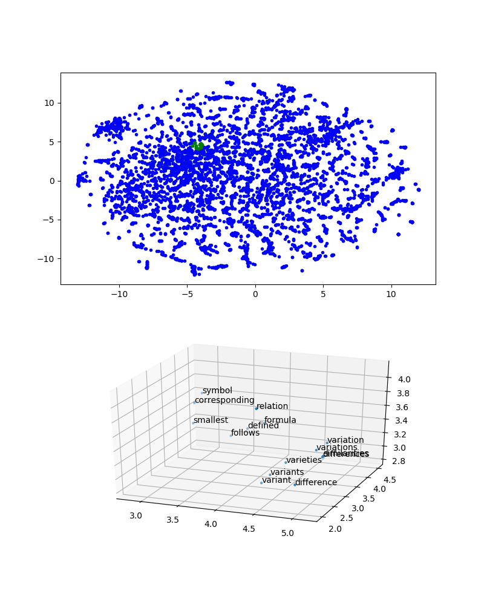
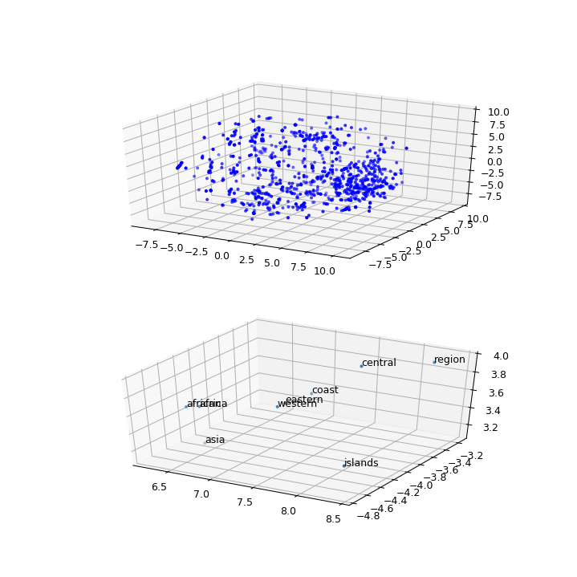

This functions allow visualization of word embeddings in 2D or 3D spaces in iPython Notebooks. Some interactive features similar to Tensorflow's [Embeddings Projector](http://projector.tensorflow.org) are implemented.

It can show a 2D mapping that can zoom in to a neighborhood in 2D or 3D by clicking:

And it can also show 3D mappings that you can free rotate an zoom in to:

